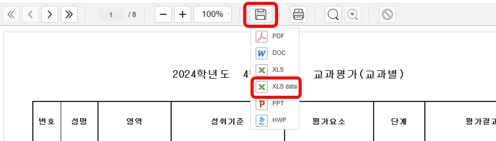
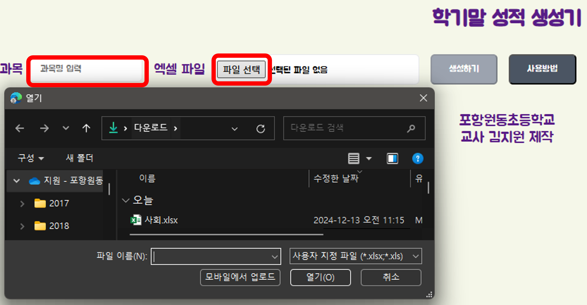

# 행발 생성기

AI를 활용하여 유치원, 초등학교, 중·고등학교 학생들의 행동특성 및 종합의견을 생성하는 웹 애플리케이션입니다.

## 주요 기능

- **AI 기반 내용 생성**: Google Gemini API를 활용하여 각 학교급에 최적화된 행동특성 및 종합의견 문장을 생성합니다.
- **생성 길이 조절**: '짧게(3문장)', '보통(5-8문장)', '길게(10-15문장)' 중에서 원하는 길이로 생성할 수 있습니다.
- **데이터 입력 방식**:
  - **엑셀 파일 일괄 업로드**: 지정된 서식의 엑셀 파일을 통해 여러 학생의 데이터를 한 번에 입력할 수 있습니다.
  - **개별 입력**: UI에서 직접 학생 정보를 입력하고 목록에 추가할 수 있습니다.
- **서식 파일 제공**: 데이터 입력에 필요한 엑셀 서식 파일을 다운로드할 수 있습니다.
- **실시간 진행률 표시**: AI 생성 과정에서 진행률을 퍼센트로 실시간 확인할 수 있습니다.
- **다크 모드 지원**: 사용자의 시각적 편의를 위한 테마 변경 기능을 제공합니다.
- **반응형 디자인**: 모바일과 데스크톱 환경 모두에서 최적화된 사용자 경험을 제공합니다.
- **내장 사용 가이드**: 앱 내에서 직접 사용방법을 확인할 수 있는 팝업 가이드를 제공합니다.

## 미리보기





## 설치 및 실행 방법

1.  **프로젝트 복제**

    ```bash
    git clone https://github.com/Cardanoian/behavior_react.git
    cd behavior_react
    ```

2.  **종속성 설치**

    ```bash
    npm install
    ```

3.  **환경 변수 설정**
    프로젝트 루트 디렉터리에 `.env.local` 파일을 생성하고 아래 내용을 추가하세요.

    ```
    VITE_GOOGLE_API_KEY="YOUR_GOOGLE_API_KEY"
    ```

    `YOUR_GOOGLE_API_KEY` 부분을 실제 Google Gemini API 키로 교체해야 합니다.

4.  **개발 서버 실행**
    ```bash
    npm run dev
    ```
    서버가 실행되면 브라우저에서 `http://localhost:5173` (또는 터미널에 표시되는 다른 주소)으로 접속할 수 있습니다.

## 사용 방법

### 1. 기본 설정

#### 1-1. 학교급 선택

- 메인 화면 상단의 **"학교급"** 섹션에서 다음 중 하나를 선택합니다:
  - **유치원**: 유치원생 대상 (놀이 활동 항목 포함)
  - **초등학교**: 초등학생 대상 (기본 선택)
  - **중,고등학교**: 중·고등학생 대상
- 학교급을 변경하면 기존 입력 데이터가 초기화됩니다.

#### 1-2. 생성 길이 설정

- 화면 우측 상단의 **"생성 길이"** 드롭다운에서 원하는 길이를 선택합니다:
  - **짧게**: 간결하게 3문장 정도로 생성
  - **보통**: 5-8문장 정도로 생성 (기본값)
  - **길게**: 상세하게 10-15문장으로 생성

### 2. 데이터 입력 방법

#### 방법 A: 엑셀 파일 일괄 업로드 (권장)

1. **서식 파일 다운로드**

   - **"서식파일"** 버튼(다운로드 아이콘)을 클릭합니다.
   - 선택한 학교급에 맞는 엑셀 템플릿 파일이 자동으로 다운로드됩니다.

2. **엑셀 파일 작성**

   - 다운로드한 엑셀 파일을 열어 학생 정보를 입력합니다.
   - **필수 입력 항목**:
     - **번호**: 학생 번호 또는 순서
     - **학생 특성**: 학생의 행동 특성이나 성향
     - **놀이 활동** (유치원만): 놀이 관련 활동 내용
   - **입력 예시**:
     - 번호: "1", "2", "3" 등
     - 학생 특성: "만들기를 좋아하고 자연물로 그림 그리는 것을 즐김. 친구에게 선물하는 것을 좋아함."
     - 놀이 활동: "산책 시간에 돌멩이나 꽃잎을 주워서 미술 활동에 사용함."

3. **파일 업로드**
   - **"파일 선택"** 버튼(업로드 아이콘)을 클릭합니다.
   - 작성한 엑셀 파일(.xlsx 또는 .xls)을 선택합니다.
   - 파일이 성공적으로 업로드되면 파일명이 표시되고, 학생 목록이 하단 테이블에 자동으로 추가됩니다.

#### 방법 B: 개별 입력

1. **"데이터 개별 추가"** 섹션으로 이동합니다.

2. **정보 입력**

   - **번호**: 학생 번호나 순서를 입력합니다.
   - **학생 특성**: 학생의 행동 특성, 성향, 장점 등을 구체적으로 입력합니다.
   - **놀이 활동** (유치원 선택 시만 표시): 놀이와 관련된 구체적인 활동 내용을 입력합니다.

3. **목록에 추가**
   - 모든 필수 항목을 입력한 후 **"추가"** 버튼을 클릭합니다.
   - 입력한 학생 정보가 하단 테이블에 추가되고, 입력 필드는 자동으로 초기화됩니다.
   - 필요한 만큼 반복하여 여러 학생을 추가할 수 있습니다.

### 3. 행동발달 및 종합의견 생성

1. **생성 시작**

   - 학생 데이터가 입력되면 **"생성하기"** 버튼(별 아이콘)이 활성화됩니다.
   - 버튼을 클릭하여 AI 생성을 시작합니다.

2. **진행 상황 확인**

   - 생성이 시작되면 버튼이 **"처리 중... X%"**로 변경됩니다.
   - 진행률 바가 표시되어 실시간으로 진행 상황을 확인할 수 있습니다.
   - 학생 수에 따라 몇 분 정도 소요될 수 있습니다.

3. **결과 확인**
   - 생성이 완료되면 각 학생의 **"행동발달 및 종합의견"** 열에 AI가 생성한 내용이 표시됩니다.
   - 생성된 내용은 선택한 학교급과 길이 설정에 맞게 최적화됩니다.

### 4. 결과 활용

1. **내용 복사**

   - 테이블의 각 셀을 클릭하여 내용을 선택하고 복사할 수 있습니다.
   - 생성된 내용을 학교생활기록부나 다른 문서에 붙여넣기하여 활용합니다.

2. **엑셀 파일 다운로드**
   - 생성이 완료되면 결과가 포함된 엑셀 파일이 자동으로 다운로드됩니다.
   - 다운로드된 파일에는 입력한 학생 정보와 생성된 행동발달 및 종합의견이 모두 포함됩니다.

### 5. 추가 기능

#### 개별 학생 삭제

- 테이블의 각 행 맨 왼쪽에 있는 **휴지통 아이콘**을 클릭하여 특정 학생을 목록에서 삭제할 수 있습니다.

#### 전체 초기화

- **"초기화"** 버튼(회전 화살표 아이콘)을 클릭하면 모든 입력 데이터와 결과가 삭제됩니다.
- 새로운 작업을 시작할 때 사용합니다.

#### 사용방법 가이드

- **"사용방법"** 버튼(물음표 아이콘)을 클릭하면 앱 내에서 상세한 사용 가이드를 확인할 수 있습니다.

#### 다크 모드

- 화면 우측 상단의 **테마 토글 버튼**을 클릭하여 라이트/다크 모드를 전환할 수 있습니다.

### 6. 주의사항

- **개인정보 보호**: 학생의 개인정보(이름, 상세한 개인 식별 정보 등)는 입력하지 않는 것을 권장합니다.
- **인터넷 연결**: AI 생성을 위해 안정적인 인터넷 연결이 필요합니다.
- **파일 형식**: 엑셀 파일은 .xlsx 또는 .xls 형식만 지원됩니다.
- **브라우저 호환성**: 최신 버전의 Chrome, Firefox, Safari, Edge에서 최적화되어 있습니다.

## 주요 기술 스택

- **Frontend**: React 19, Vite, TypeScript
- **Styling**: Tailwind CSS, shadcn/ui
- **UI Components**: Radix UI (접근성 최적화)
- **Icons**: Lucide React
- **AI**: Google Gemini API
- **File Processing**: SheetJS (xlsx)
- **Build Tool**: Vite

## 개발 정보

- **제작자**: 포항원동초등학교 교사 김지원
- **라이선스**: ISC License &copy; 2025, 김지원
- **저장소**: https://github.com/Cardanoian/behavior_react.git

## 문제 해결

### 자주 발생하는 문제

1. **API 키 오류**

   - `.env.local` 파일에 올바른 Google Gemini API 키가 설정되어 있는지 확인하세요.문

2. **파일 업로드 실패**

   - 엑셀 파일이 올바른 형식(.xlsx, .xls)인지 확인하세요.
   - 서식 파일을 다운로드하여 해당 형식에 맞게 데이터를 입력했는지 확인하세요.

3. **생성 실패**

   - 인터넷 연결 상태를 확인하세요.
   - 잠시 후 다시 시도해보세요.

4. **화면 표시 문제**
   - 브라우저를 새로고침하거나 캐시를 삭제해보세요.
   - 최신 버전의 브라우저를 사용하고 있는지 확인하세요.
